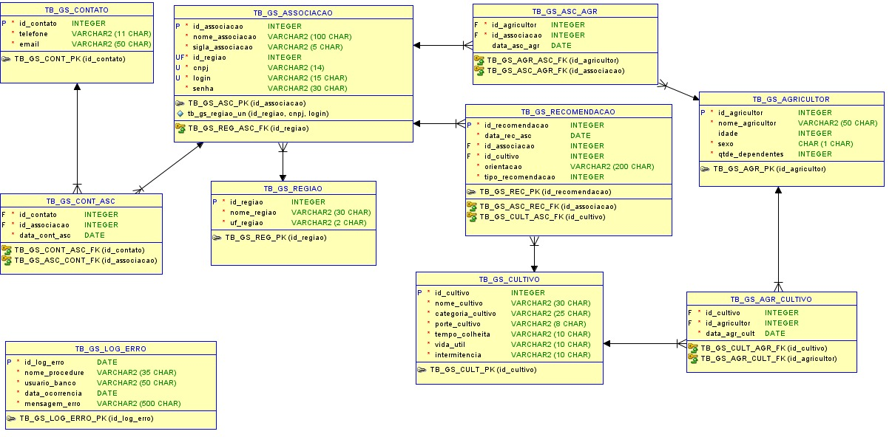

# Celticstech

API REST desenvolvida para a Global Solution 2026/1, com foco em Economia
Espacial e monitoramento agricola do Nordeste brasileiro.

O projeto combina dados cadastrais, coordenadas geograficas e informacoes
climaticas em tempo real para apoiar associacoes e produtores rurais.

## Integrantes

- Joao Victor Vendrameto - RM 563665 - 2TDSPV
- Nicolas de Oliveira Jacob - RM 564205 - 2TDSPX
- Gabriel Ambrosio Saraiva - RM 566552 - 2TDSPV
- Vinicius Romaguera Cardozo - RM 562308 - 2TDSPX
- Yuri Fuzinatto Garzoli Barreto - RM 561450 - 2TDSPX

## Tecnologias

- .NET 8
- ASP.NET Core Web API
- Entity Framework Core
- PostgreSQL
- Swagger / OpenAPI
- Docker e Docker Compose
- Open-Meteo API

## Funcionalidades

- CRUD de regioes, associacoes, cultivos e recomendacoes
- Front-end responsivo servido pelo proprio ASP.NET Core
- Coordenadas automaticas a partir da UF
- Consulta climatica em tempo real
- Diagnostico agricola com score de risco
- Persistencia do historico climatico
- Dashboard operacional
- Health Check

## Coordenadas automaticas

No cadastro ou atualizacao de uma regiao, o usuario informa apenas o nome e a
UF. O `CoordenadasService` preenche latitude e longitude automaticamente.

UFs aceitas:

```text
BA, PE, CE, MA, PI, RN, PB, AL e SE
```

Exemplo:

```json
{
  "nomeRegiao": "Pernambuco",
  "ufRegiao": "PE"
}
```

## Integracao com Open-Meteo

O `OpenMeteoService` consulta a API publica Open-Meteo por HTTP GET, sem SDK
ou autenticacao para o uso atual.

Dados consultados:

- `temperature_2m`
- `relative_humidity_2m`
- `wind_speed_10m`
- `rain`

Endpoint:

```http
GET /api/Satelite/clima/regiao/{id}
```

Exemplo de resposta:

```json
{
  "idRegiao": 1,
  "regiao": "Pernambuco",
  "uf": "PE",
  "latitude": -8.0476,
  "longitude": -34.877,
  "temperatura": 29,
  "umidade": 72,
  "velocidadeVento": 14,
  "chuva": 0,
  "scoreRisco": 75,
  "nivelRisco": "ALTO",
  "fonteDados": "Open-Meteo"
}
```

## Score de risco

O score varia de 0 a 100 e considera quatro fatores:

- Temperatura: ate 15 pontos
- Chuva: ate 70 pontos
- Baixa umidade: ate 10 pontos
- Velocidade do vento: ate 5 pontos

Classificacao:

```text
0 a 39   -> BAIXO
40 a 69  -> MODERADO
70 a 100 -> ALTO
```

As faixas intermediarias recebem pontuacao parcial para evitar mudancas
bruscas no indicador.

## Diagnostico climatico

Endpoint:

```http
GET /api/Diagnostico/regiao/{id}
```

O diagnostico consulta o clima, calcula o score, gera uma orientacao e salva
uma recomendacao com a fonte `Open-Meteo API`.

Opcionalmente, e possivel selecionar os vinculos usados na recomendacao:

```http
GET /api/Diagnostico/regiao/1?idAssociacao=1&idCultivo=1
```

Sem esses parametros, a API utiliza a primeira associacao da regiao e o
primeiro cultivo cadastrado. Quando esses vinculos ainda nao existem, o
diagnostico continua disponivel, mas nao e incluido no historico persistido.

Exemplo de resposta:

```json
{
  "regiao": "Pernambuco",
  "temperatura": 36,
  "umidade": 38,
  "chuva": 0,
  "velocidadeVento": 28,
  "scoreRisco": 82,
  "nivelRisco": "ALTO",
  "recomendacao": "Resumo: Risco elevado para os cultivos monitorados. Motivo: baixa ocorrencia de chuva e temperatura elevada. Acoes: reforcar a irrigacao; priorizar cultivos sensiveis. Prazo: acao imediata nas proximas 24 horas.",
  "resumoRisco": "Risco elevado para os cultivos monitorados.",
  "motivoRisco": "O nivel foi definido por baixa ocorrencia de chuva, temperatura elevada e umidade do ar reduzida.",
  "acoesRecomendadas": [
    "Reforcar a irrigacao e verificar a umidade do solo antes do proximo ciclo.",
    "Priorizar os cultivos mais sensiveis ao calor e ao deficit hidrico.",
    "Monitorar sinais de estresse hidrico nas folhas e ajustar o manejo da irrigacao.",
    "Evitar pulverizacao de defensivos e proteger estruturas agricolas expostas."
  ],
  "prioridade": "Alta",
  "prazoSugerido": "Acao imediata nas proximas 24 horas.",
  "observacaoTecnica": "Analise calculada com dados climaticos em tempo real da Open-Meteo API, considerando temperatura, chuva, umidade e velocidade do vento.",
  "fonteDados": "Open-Meteo API"
}
```

## Recomendacoes agricolas detalhadas

O sistema nao informa apenas o nivel de risco. Cada diagnostico gera uma
orientacao tecnica organizada com:

- Resumo e motivo do risco
- Acoes praticas para o manejo agricola
- Prioridade de atendimento
- Prazo sugerido
- Observacao tecnica e fonte dos dados

O retorno detalhado e usado pelo front-end para montar o card de diagnostico.
Uma versao compacta, com ate 300 caracteres, e salva no campo `Orientacao`
para manter compatibilidade com o banco atual sem criar novas colunas.

O front tambem aceita respostas antigas da API. Quando os novos campos nao
estao presentes, ele organiza a recomendacao anterior em uma visualizacao
compativel.

## Historico climatico

```http
GET /api/Recomendacoes/historico-climatico
```

Exemplo:

```json
[
  {
    "idRecomendacao": 1,
    "data": "2026-06-09T00:00:00Z",
    "associacao": "Cooperativa de Produtores do Sertao",
    "cultivo": "Milho",
    "nivelRisco": "ALTO",
    "scoreRisco": 87,
    "temperatura": 36,
    "umidade": 35,
    "chuva": 0,
    "velocidadeVento": 28,
    "orientacao": "Resumo: Risco elevado para os cultivos monitorados. Motivo: baixa ocorrencia de chuva e temperatura elevada. Acoes: reforcar a irrigacao; priorizar cultivos sensiveis. Prazo: acao imediata nas proximas 24 horas.",
    "fonteDados": "Open-Meteo API"
  }
]
```

No painel, cada linha do historico pode ser selecionada para abrir os detalhes
da associacao, cultivo, clima, score, orientacao e fonte dos dados.

## Dados agricolas de exemplo

Os formularios usam exemplos contextualizados para o Nordeste, como:

- Regioes: Pernambuco/PE, Bahia/BA e Ceara/CE
- Associacoes: Cooperativa de Produtores do Sertao e Associacao Rural Vale do Sao Francisco
- Cultivos: Milho, Mandioca e Caju
- Categorias: Graos, Raiz e Frutifera
- Ciclos: `120 dias`, `10 a 14 meses` e `180 dias`
- Intermitencias: Anual, Semiperene e Perene

Os valores de `porteCultivo` seguem o contrato atual do backend:
`ARBUSTO`, `RAIZ`, `ARVORE` ou `HORTALICA`.

## Dashboard

```http
GET /api/Dashboard/resumo
```

Exemplo:

```json
{
  "totalRegioes": 5,
  "totalAssociacoes": 3,
  "totalCultivos": 10,
  "totalRecomendacoes": 20,
  "integracaoOpenMeteo": "Ativa",
  "statusSistema": "Operacional"
}
```

## Front-end

O painel responsivo usa HTML, CSS, JavaScript puro, Bootstrap 5 e Chart.js.
Ele e publicado pelo proprio ASP.NET Core a partir de `Celticstech/wwwroot`.

Recursos disponiveis:

- Dashboard com totais e estado da integracao
- Consulta climatica por regiao e grafico de indicadores
- Diagnostico agricola com score de risco
- Historico climatico paginado
- Gerenciamento de regioes, associacoes, cultivos e recomendacoes
- Formularios de cadastro e edicao em modal
- Confirmacao visual antes de exclusoes
- Mensagens de sucesso, alerta e erro
- Tema claro e escuro salvo no navegador
- Deteccao automatica da URL da API
- Validacao dos principais endpoints

O backend atual nao possui um controller de agricultores. Por isso, o painel
mostra esse cadastro como indisponivel e nao realiza chamadas para um endpoint
inexistente.

## Endpoints principais

```text
/api/Regioes
/api/Associacoes
/api/Cultivos
/api/Recomendacoes
/api/Recomendacoes/historico-climatico
/api/Satelite/clima/regiao/{id}
/api/Diagnostico/regiao/{id}
/api/Dashboard/resumo
/health
```

## Como executar

### Backend e front juntos (recomendado)

Configure a conexao PostgreSQL em `Celticstech/appsettings.json`.

Na raiz do repositorio, execute:

```powershell
dotnet run --project Celticstech/Celticstech.csproj
```

O Entity Framework aplica automaticamente as migrations pendentes na
inicializacao. Depois, abra a URL informada no terminal. No perfil HTTP padrao:

```text
http://localhost:5000
```

O ASP.NET Core serve o front diretamente da pasta `wwwroot`, portanto nao e
necessario iniciar um segundo servidor.

Swagger continua disponivel em:

```text
http://localhost:5000/swagger
```

Health Check:

```text
http://localhost:5000/health
```

O front detecta automaticamente a API usando primeiro a origem atual e depois
as portas locais `5000`, `5001`, `8080`, `7143` e `5143`.

### Front separado (alternativo)

Use este modo apenas quando quiser desenvolver os arquivos da pasta
`frontend` separadamente:

```powershell
cd frontend
python -m http.server 5500
```

Depois abra:

```text
http://localhost:5500
```

O CORS do backend permite que esse front separado consuma a API detectada.

## Docker

Na pasta `Celticstech`:

```powershell
docker compose up --build
```

Swagger:

```text
http://localhost:8080/swagger
```

Painel:

```text
http://localhost:8080
```

Os arquivos de `wwwroot` sao incluidos automaticamente no `dotnet publish` e
no build da imagem Docker.

## Health Check

```http
GET /health
```

Uma resposta HTTP `200` indica que a aplicacao esta operacional.

## Modelagem


